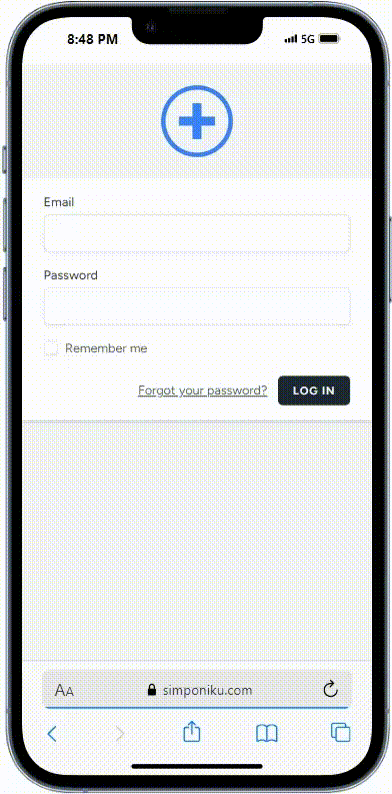

# SIMPONIKU - Sistem Monitoring Posyandu Kunjungan

SIMPONIKU adalah aplikasi digital untuk membantu pencatatan dan pemantauan kunjungan harian keluarga di posyandu. Aplikasi ini mempermudah pengelolaan data kesehatan masyarakat secara real-time dan terstruktur berdasarkan **kelompok sasaran** seperti Ibu Hamil, Balita, Remaja, Dewasa, dan Lansia.

---

## Fitur Utama

- **Dashboard**:  
  Menampilkan statistik jumlah keluarga dan anggota keluarga serta kategori kelompok sasaran.

- **Kunjungan Rumah**:  
  Form pencatatan kunjungan harian dengan data lengkap terkait keluarga dan kondisi lingkungan.

- **Statistik Kategori Keluarga**:  
  Laporan berdasarkan kecamatan, kelurahan, dan posyandu. Statistik disusun berdasarkan **kelompok sasaran**.

- **Akses Berdasarkan Peran Pengguna**:  
  - **Admin**: Mengakses semua data di seluruh wilayah.
  - **Petugas Kesehatan Kecamatan**: Mengakses data posyandu di kecamatannya.
  - **Ketua Posyandu**: Mengakses data posyandu tertentu yang ia kelola.

---
## Cara Penggunaan

1. **Login ke Aplikasi**  
   Masuk menggunakan email dan password sesuai dengan peran pengguna (Admin, Petugas Kesehatan, atau Ketua Posyandu).

2. **Menambah Data Keluarga**  
   - Akses menu **Kunjungan Rumah** dan isi data lengkap keluarga serta anggota.
   - Pilih **Kelompok Sasaran** yang sesuai untuk setiap anggota keluarga.

3. **Melihat Statistik**  
   - Akses menu **Statistik** dan gunakan **Filter Kecamatan, Kelurahan, atau Posyandu** untuk melihat data spesifik.
   - **Admin** dan **Petugas Kesehatan** dapat melihat semua data.
   - **Ketua Posyandu** hanya dapat melihat data posyandu yang ia kelola.

---

## Kelompok Sasaran dalam Kunjungan Harian

- **Ibu Hamil**: Pemantauan kesehatan ibu selama masa kehamilan.
- **Ibu Bersalin & Nifas**: Pemulihan pasca melahirkan dan pemberian ASI.
- **Bayi - Balita (0-6 bulan)**: Pemberian imunisasi dan pemantauan tumbuh kembang.
- **Balita dan Apras (6-71 bulan)**: Monitoring gizi dan imunisasi lanjutan.
- **Usia Sekolah & Remaja**: Edukasi dan pemantauan kesehatan remaja.
- **Usia Dewasa (18-59 tahun)**: Pemantauan penyakit seperti hipertensi dan diabetes.
- **Lansia (≥60 tahun)**: Pemantauan kesehatan rutin untuk lansia.

---

## Teknologi yang Digunakan

- **Backend**: Laravel  
- **Frontend**: Bootstrap, Blade Templates  
- **Database**: MySQL  
- **Authentication**: Laravel Passport  
- **Role Management**: Spatie Laravel Permissions  

---

## Akses Statistik Berdasarkan Peran

- **Admin**: Melihat seluruh data posyandu di semua wilayah.
- **Petugas Kesehatan Kecamatan**: Melihat data seluruh posyandu di kecamatannya.
- **Ketua Posyandu**: Melihat data posyandu tertentu yang ia kelola.

---

## Kebutuhan Sistem

- **PHP**: >= 8.0  
- **Composer**: >= 2.0  
- **MySQL**: >= 5.7  
- **Node.js**: >= 14.x  

---

## Pengembangan dan Kontribusi

1. **Fork** repository ini.
2. Buat **branch baru** untuk fitur yang ingin dikembangkan.
3. Setelah selesai, buat **Pull Request** ke branch `main`.

---

## Lisensi

Aplikasi ini dilisensikan di bawah [MIT License](https://opensource.org/licenses/MIT).

---

## Kontak

Jika ada pertanyaan atau butuh bantuan, hubungi:  
- **Email**: galihsetyawan29@gmail.com

